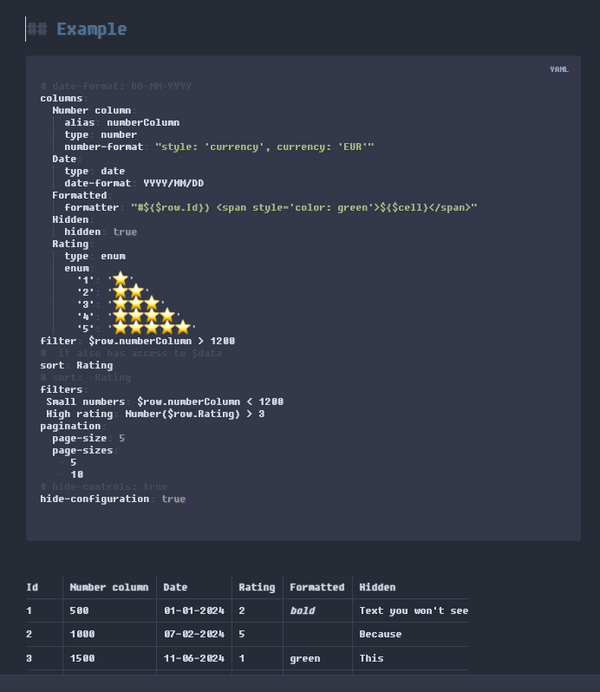

# Dynamic Table Plugin for Obsidian

A powerful and customizable dynamic table plugin for Obsidian that expands the [obsidian-enhanced-tables plugin](https://github.com/pistacchio/obsidian-enhanced-tables)

This plugin is an updated and extended version based on the original **Enhanced Tables** plugin by [pistacchio](https://github.com/pistacchio). Without their effort I would not have been able to get started on their work, I cannot thank them enough for their original work.

# Whats new?
1) Any functionality stacks. Meaning that you can sort by column title, the ascending/descending entries while having multiple filters active and being able to search to narrow things down even further all at the same time!
2) Checkboxes in Obsidian can be problematic especially with YAML, the best I found for some time was in [obsidian-table-checkboxes](https://github.com/0x-DLN/obsidian-table-checkboxes) with example `<input type="checkbox" unchecked id="cfa0fe">`, if you clicked their checkbox `<input type="checkbox" checked id="cfa0fe">` it would save the state in the markdown. However, with YAML and the enhanced table plugin, this would break the functionality, causing you to need to reload each time, which was not ideal. Now there is this: `<input type="checkbox" id="cfa0fe">` for this format instead I made a script that will export to a folder called `_checkbox-states` inside of your vault folder. This will save the states of those checkboxes externally to a JSON file without breaking the UI! This was necessary because the id format without checked or unchecked doesn't break the controls but also doesn't save if they have been checked for future sessions, hence my script. Also, I did make it so if you update your file name or delete your file it will adjust the appropriate JSON file as well. (If you edit the file name refresh the document before checking boxes just to be safe)
3) I made it so you could filter a column by whether or not a checkbox was checked or unchecked, it must be `.includes` true or false for checked or unchecked boxes. Example below: (note the formatting for the filter, the only things to be changed are columnTitle to your column name, leave the ?, and also the headername to desired header and example to desired filter name)

``` 
filters:
  Headername:
    Example: "$row.columnTitle?.includes('true')"
    Exampl2: "$row.columnTitle?.includes('true')"
  OtherHeaderName:
    Example3: "$row.columnTitle?.includes('false')"
```

4) You may have noticed above with Headername: and OtherHeaderName:, I made it so you could have filter headers that appear above your grouped filters. This was for people who have lots of filters and wanted an easier time visually.
5) I made it so you could control the UI view, whether or not you want the Sort, Search, or Filter sections to appear with a YAML config! Check below: (true = visible, false = not visible)

```
controls:
  showSort: true
  showSearch: true
  showFilter: true
```
6) I added the ability to color every other row a bit darker for better visibility to user to distinguish between rows. As well as hover effect. `styleEnhancements:` `zebraStriping: true` `  rowHoverHighlight: true` `horizontalTextAlignment: left`
7) I added horizontal text alignment yaml option, the alignment has options `left` `center` `right`
8) I added vertical text alignment yaml option, the alignment has options `top` `center` `bottom`

```
styleEnhancements:
  zebraStriping: true
  rowHoverHighlight: true
  horizontalTextAlignment: left
  verticalTextAlignment: top
```


### Community Plugin
- Open Settings > Third-party plugin
- Make sure Safe mode is off
- Click Browse community plugins
- Search for "Dynamic Table Plugin"
- Click Install
- Once installed, close the community plugins window and activate the newly installed plugin

# Example of my YAML and Table
If you want to copy the YAML or Table, check the Dynamic Table plugin settings
### YAML Example
```yaml dynamic-table
columns:
  Column A:
    alias: Column A
    type: string
    searchable: true
  Column B:
    alias: Column B
    type: string
    searchable: true
  Column C:
    alias: Column C
    type: string
    searchable: true

filters:
  Example Header 1:
    Column A: "$row['Column A']?.includes('true')"
    Column B: "$row['Column B']?.includes('false')"

controls:
  showSort: true
  showSearch: true
  showFilter: true
  
styleEnhancements:
  zebraStriping: true
  rowHoverHighlight: true
  horizontalTextAlignment: left

hide-configuration: true
```
## Table Example
```
| Column A                            | Column B                            | Column C |
| ----------------------------------- | ----------------------------------- | -------- |
| <input type="checkbox" id="68aad5"> | <input type="checkbox" id="2b6727"> | Text1    |
| <input type="checkbox" id="f797ca"> | <input type="checkbox" id="143b85"> | Text2    |
| <input type="checkbox" id="c545ad"> | <input type="checkbox" id="e04729"> | Text3    |
| <input type="checkbox" id="a8b8d4"> | <input type="checkbox" id="c9ec42"> | Text4    |
```

--- 

# Enhanced Tables instruction down below:
I left this hear for the sake of ease of understanding the full scope of the functions related to the original project. Again I would like to thank [pistacchio](https://github.com/pistacchio) for their original work on [obsidian-enhanced-tables plugin](https://github.com/pistacchio/obsidian-enhanced-tables). I would not have been able to do this if not for them.

# Enhanced tables

A plugin for [Obsidian](https://obsidian.md/) to add advanced controls (like sorting, filtering and pagination) to standard markup tables.

Its is heavily inspired by [DataLoom](https://dataloom.xyz/) which is an incredible plugin, but I wanted my data to be stored in simple, easily accessible and editable tables, and not in JSON files which integrate in a less seamless way into the Obsidian workflow.

## Example



## Features

- Add a configurable pagination to tables
- Write custom filters and dynamically switch between them
- Sort the table rows by their values
- Apply automatic formatting for dates and numbers
- Define "enum" columns with fixed values
- Implement per-column custom formatting

## How to install

### Community Plugin
- Open Settings > Third-party plugin
- Make sure Safe mode is off
- Click Browse community plugins
- Search for "Enhanced tables"
- Click Install
- Once installed, close the community plugins window and activate the newly installed plugin

### Manually installing the plugin
- Go to the latest Releases
- Download main.js, manifest.json
- save into your vault VaultFolder/.obsidian/plugins/enhanced-tables/

## How it works

If you want to add some advanced control or formatting to any standard Obsidian table, define _before_ it a block of [yaml](https://quickref.me/yaml.html) code with the **Enhanced tables** configurations you want to apply to the table. When switching to view mode, if the configuration is corrent, the table will be formatted according to the provided configuration and will have all the needed advanced controls.

## Configuration

### Example configuration for the provided sample table

<pre>
```yaml enhanced-tables

# date-format: DD-MM-YYYY
yes-format: "yes"
no-format: "no"

columns:
  Number column:
    alias: numberColumn
    type: number
    number-format: "style: 'currency', currency: 'EUR'"
  Date:
    type: date
    date-format: YYYY/MM/DD
  Formatted:
    formatter: "`#${$row.Id}) <span style='color: green'>${$cell}</span>`"
    nowrap: true
  Hidden:
    hidden: true
  Rating:
    type: enum
    enum:
      '1': '⭐️'
      '2': '⭐️⭐️'
      '3': '⭐️⭐️⭐️'
      '4': '⭐️⭐️⭐️⭐️'
      '5': '⭐️⭐️⭐️⭐️⭐️'
  Boolean:
    type: bool
    yes-format: '👍'
    no-format: '👎'
filter: $row.numberColumn > 1200
filters:
 Small numbers: $row.numberColumn < 1200
 High rating: Number($row.Rating) > 3
sort: Rating
# sort: -Rating
pagination:
  page-size: 5
  page-sizes:
   - 5
   - 10
style: |
   th {
     background-color: var(--color-base-50) !important;
     color: var(--color-base-70) !important;
   }
# hide-controls: true
hide-configuration: true
```
</pre>

<pre>
| Id | Number column | Date       | Rating | Formatted    | Hidden             | Boolean  |
|----|---------------|------------|--------|--------------|--------------------| -------- |
| 1  | 500           | 01-01-2024 | 2      | _**bold**_   | Text you won't see |          |
| 2  | 1000          | 07-02-2024 | 5      |              |                    | no       |
| 3  | 1500          | 11-06-2024 | 1      | green        |                    | yes      | 
| 4  | 10000         | 05-01-2024 | 4      | ~~strike~~   |                    | whatever |
</pre>

### Configuration syntax

#### Yaml code opening syntax - `yaml enhanced-tables`

In order to be recognized as a valid **Enhanced tables** (**ET**), the yaml code must be defined with the `enhanced-tables` keyword.

<pre>
```yaml enhanced-tables
</pre>

#### Configuration properties

All the configuration properties are optional.

| Property             | Type      | Description                                                                                                                                                                                                                                                                                                                                                                                  |
|----------------------|-----------|----------------------------------------------------------------------------------------------------------------------------------------------------------------------------------------------------------------------------------------------------------------------------------------------------------------------------------------------------------------------------------------------|
| `date-format`        | `string`  | Must be a valid [moment.js string](https://momentjs.com/docs/#/parsing/string-format/).<br> This property defines the _input_ format for all columns of type `date`, eg how **ET** expects you to write them.<br> The default is `DD-MM-YYYY`.                                                                                                                                              |
| `datetime-format`    | `string`  | Must be a valid [moment.js string](https://momentjs.com/docs/#/parsing/string-format/).<br> This property defines the _input_ format for all columns of type `datetime`, eg how **ET** expects you to write them.<br> The default is `DD-MM-YYYY HH:mm`.                                                                                                                                    |
| `yes-format`         | `string`  | The string that specifies, table-wide, how a boolean `true` value is represented in columns of type `bool`. The default is `"1"`                                                                                                                                                                                                                                                             |
| `no-format`          | `string`  | The string that specifies, table-wide, how a boolean `false` value is represented in columns of type `bool`. The default is `"0"`                                                                                                                                                                                                                                                            |
| `columns`            | `object`  | An object with the configurations for the table columns. Each column is optional: you don't have to configure a column if you don't need any advanced feature for it. The name of column must match the one on the first row of the table (its header).<br> Each column configuration is an object: see [Column configuration properties](#column-configuration-properties) for the details. |
| `filter`             | `string`  | Default filter for the table. Write it like a Javascript expression that has access to the `$row` variable.<br>Example: <ul><li>`$row.rating > 3`</li><li>`$row.status === 'active'`</li></ul>                                                                                                                                                                                               |
| `filters`            | `object`  | Additional filters. The keys of the object will populate the filter selection dropdown. The value of each key is a Javascript expression that has access to the `$row` variable - see `filter` above.                                                                                                                                                                                        |
| `sort`               | `string`  | Name or alias of the column to sort the table by. Prepend the name or alias with `-` to specify descendant soring (eg: `lastUpdated` and `-lastUpdated`).                                                                                                                                                                                                                                    |
| `pagination`         | `object`  | Pagination options, see [Pagination configuration properties](#pagination-configuration-properties) for the details.                                                                                                                                                                                                                                                                         |
| `hide-controls`      | `boolean` | If `true` do not show the sort and filter controls.                                                                                                                                                                                                                                                                                                                                          |
| `hide-configuration` | `boolean` | If `true` hide the **ET** yaml configuration code when in in view mode.                                                                                                                                                                                                                                                                                                                     |
| `style`              | `string`  | A css string to apply custom styling to the table                                                                                                                                                                                                                                                                                                                                            |
| `editable`           | `boolean` | If `true`, the values of the column are editable also in view mode with inputs appropriate to the `type` of each column. This default configuration can be overridden per-column ⚠️ **This is an experimental feature. It might not work as expected, corrupt your data and provide a user experience that is not optima!**                                                                  |

<h5 dir="auto" id="column-configuration-properties">Column configuration properties</h5

All the column configuration properties are optional.

| Property        | Type      | Description                                                                                                                                                                                                                                                                                                                                                                                                                                                                                                                                                                                                                                                                                                                              |
|-----------------|-----------|------------------------------------------------------------------------------------------------------------------------------------------------------------------------------------------------------------------------------------------------------------------------------------------------------------------------------------------------------------------------------------------------------------------------------------------------------------------------------------------------------------------------------------------------------------------------------------------------------------------------------------------------------------------------------------------------------------------------------------------|
| `alias`         | `string`  | Sometimes column names can be long and not convienient to bse used in filters and formatter. You can specify an alias string for the column. If you do so, you _must_ use it in filters and formatters.                                                                                                                                                                                                                                                                                                                                                                                                                                                                                                                                  |
| `type`          | `string`  | Type of the column values. The possible values are: `string` \| `number` \| `date` \| `datetime` \| `time` \| `enum` \| `bool`. The default is `string`.<br> The display format of a column of type `number` can be specified by the property `number-format`.<br> The display format of a column of type `date` or `datetime` can be specified by the property `date-format` while `time` columns are always read formatted as `HH:mm`.<br> The display format of a column of type `enum` can be specified by the property `enum`.<br> The display format of a column of type `bool` can be specified by the property `bool`. **ET** determines if a value is boolean if it's equal to the one specified in the root-level `yes-format` |
| `hidden`        | `boolean` | If `true` the column won't be displayed.                                                                                                                                                                                                                                                                                                                                                                                                                                                                                                                                                                                                                                                                                                 |
| `nowrap`        | `boolean` | If `true`, applies [`white-space: nowrap`](https://developer.mozilla.org/en-US/docs/Web/CSS/white-space) to the column cells.                                                                                                                                                                                                                                                                                                                                                                                                                                                                                                                                                                                                            |
| `number-format` | `string`  | How to format the numeric values of the column. It must be a string that defines options for Javascript's [Intl.NumberFormat](https://developer.mozilla.org/en-US/docs/Web/JavaScript/Reference/Global_Objects/Intl/NumberFormat).<br> Examples: <ul><li>`"style: 'currency', currency: 'JPY'"`</li><li>`"maximumSignificantDigits: 3"`</li></ul>                                                                                                                                                                                                                                                                                                                                                                                        |
| `date-format`   | `string`  | How to format the `date` or `datetime` values of the column. It must be a a valid [moment.js string](https://momentjs.com/docs/#/parsing/string-format/).<br>Overrides the root-level `date-format` and `datetime-format` if provided.<br> Examples: <ul><li>`"YYYY-MM"`</li><li>`"DD/MM/YY HH:mm"`</li></ul>                                                                                                                                                                                                                                                                                                                                                                                                                            |
| `yes-format`    | `object`  | Defines how `true` boolean values are formatted. The default value is `"✔"` .                                                                                                                                                                                                                                                                                                                                                                                                                                                                                                                                                                                                                                                            |
| `no-format`     | `object`  | Defines how `false` boolean values are formatted. The default value is `"✖"` .                                                                                                                                                                                                                                                                                                                                                                                                                                                                                                                                                                                                                                                           |
| `formatter`     | `string`  | A custom formatter for the column values. Accepts any javascript code. Typically you want to use some [Javascript template literal string](https://developer.mozilla.org/en-US/docs/Web/JavaScript/Reference/Template_literals) like in the example. It has access to the variables `$cell`, `$row` and $ctx with some additional context.<br> Examples: <ul><li>`"\`#${$row.someOtherColumn}) <strong>${$cell}</strong>\`"`</li></ul>                                                                                                                                                                                                                                                                                                   |
| `enum`          | `object`  | Defines how enum values are formatted. Each key of the `enum` object is a valid enum string and its value is how it will be displayed.<br>Example: <pre>enum:<br>&nbsp;&nbsp;- won: "\<span style="color: green"\>WON\</span\>"<br>&nbsp;&nbsp;- lost: "\<span style="color: red"\>LOST\</span\>"</pre>                                                                                                                                                                                                                                                                                                                                                                                                                                  |
| `editable`      | `boolean` | Overrides the root-level `editable` value for the specific column, so that it is possible to only make some columns editable in view mode.                                                                                                                                                                                                                                                                                                                                                                                                                                                                                                                                                                                               |
| `searchable`      | `boolean` | If at least one column has this value set to `true`, show a search input tha can be used to filter the results looking into the values of the `searchable` columns.                                                                                                                                                                                                                                                                                                                                                                                                                                                                                                                                                                      |

<h5 dir="auto" id="pagination-configuration-properties">Pagination configuration properties</h5

| Property     | Type     | Description                                                                     |
|--------------|----------|---------------------------------------------------------------------------------|
| `page-size`  | `number` | Mandatory. How many items to display per page.                                  |
| `page-sizes` | `array`  | Array of numbers defining the selectable page sizes. Defaults are: 25, 50, 100. |

## Advanced use

### TableManager Api

The **Enhanced tables** plugin exposes a utility Api to work with markdown tables within a file. You can use it to program advanced integrations with custom tables, like buttons that change the table within a file.

A `Tablemanager` instance is exposed by the plugin and can be programmatically accessed via `app.plugins.plugin['enhanced-tables'].tableManager`;

#### `Tablemanager`

Each row of the table is represented by an array of `string`s, each being the content of a cell.

```typescript 
  type LineValues = string[];
```

The class exposes the following methods:

```typescript
// In all the following methods:
//   `lineNo` = 0 = first data line
//   `lineNo` = n = nth line
//   `lineNo` = -1 = last line

// In all the following methods `fileContent: string` is typically the content of the current file
// accessible with `this.app.workspace.getActiveViewOfType(MarkdownView)?.data` or the content
// of a file got with `this.app.vault.read()`

// In all the following methods `tableIndex: number = 0`  is the optional index of the table in the file
// if a file has multiple tables in it. `0` is the first column, `1` the second and so on. 

// Insert the new table line represented by `values` into the provided fileContent at position `lineNo`.
//   Return the modified file content
function insertLine(fileContent: string, lineNo: number, values: LineValues, tableIndex = 0): string {}

// Replace the table line at position `lineNo` in the provided fileContent with
//   a new table line represented by `values`
//   Return the modified file content
function modifyLine(fileContent: string, lineNo: number, values: LineValues, tableIndex = 0): string {}

// Replace the header of the table in the provided fileContent with
//   a new table header represented by `values`
//   Return the modified file content
function modifyHeader(fileContent: string, values: LineValues, tableIndex = 0): string {}

// Delete the table line at position `lineNo` in the provided fileContent with
//   Return the modified file content
function removeLine(fileContent: string, lineNo: number, tableIndex = 0): string {}

// Returns the values of the table line at position `lineNo` in the provided fileContent with
function readLine(fileContent: string, lineNo: number, tableIndex = 0): LineValues| null {}

// Returns all the values of the table in the provided fileContent with
function readTableLines(fileContent: string, tableIndex = 0): LineValues | null {}
```
